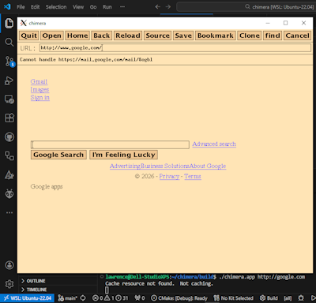
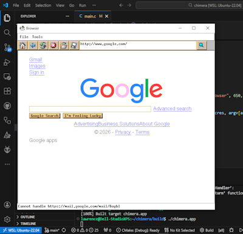
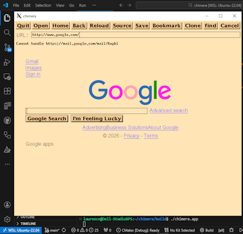

# Chimera

The *new look* for a `Native` X11/Athena World-Wide Web Browser

## Before

This is **chimera** *version 2*.

Forked from <http://hpux.connect.org.uk/hppd/hpux/Networking/WWW/chimera-2.0a19/>, using **CMake** build instead.

Please look in doc/ for license information,
build information, and other bits.

       -john

## After

This is **chimera.app** *version 3*. The difference is base on [Athena](https://github.com/zelang-dev/athena), with minimal features applied.

- No major structure changes, no SSL/TLS support enabled, nor JavaScript handling.
- The browser still follows *HTML 3.2* specs.
- The image handling is powered by using <https://github.com/nothings/stb>, <https://github.com/memononen/nanosvg>, and <https://libtiff.gitlab.io/libtiff/>.

Little difference with only [Xaw95](https://forums.freebsd.org/threads/athena-widgets-xaw-implementations.81588/) or [others](https://www.efalk.org/Widgets/) applied.

